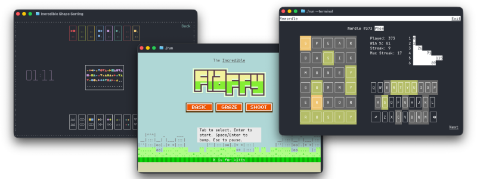

[Home](./index.md) | [Blog](./blog/index.md)

---

# TUI Games in 80x24

## TUI vs. Retro
It is common to think about Text User Interfaces (i.e. TUIs) as “retro”. Thus, when TUI games come to mind, it is common to equate them with retro games. Think Tetris, Doom or Pac-Man. However, while retro games were played “in the terminal” and were limited in their graphic capabilities compared to modern ones, they were not TUI games.

Retro 2D games operate on pixels. [The arcade version of Pac-Man](https://tralvex.com/download/forum/The%20Pac-Man%20Dossier.pdf), for example, ran at 224x288 pixels. The display was divided into 28×36 tiles, where each individual tile was 8×8 pixels. To draw a ghost, one needs 64 pixels. Modern fantasy consoles like PICO-8, which recreate the “retro feel”, use a 128x128 pixel display, with sprites again going for the 8x8 format. That’s not a lot of pixels, but it is enough. The [Flappy Bird](https://en.wikipedia.org/wiki/Flappy_Bird#/media/File:Flappy_Bird_icon.png) from the classic iPhone game fits into 17x12 pixels.

## Characters, not Pixels
TUIs don’t work with pixels; they work with characters. There aren’t many of those, and they are rectangular in shape. The historic default screen of the terminal is 80 columns by 24 rows. A Flappy Bird where every char is used as a pixel will occupy half the screen height.

24x80 is smaller and more limited than the arcade version of Pac-Man; even drawing a pixel-based ghost would be impossible. However, with the TUI being character-based, the Pac-Dots could be expressed as a Unicode dot ● and the ghost can be expressed with a ghost emoji 👻. Good. Well, maybe. That emoji would occupy 2 columns, not one. This would force the corridors to also be 2 characters wide. That dot will not be centered in the vertical ones; we’ll have to use an emoji here too ⚪. The emojis would look like a ghost and a dot, well, most of the time, but not always. Even when they do, they will look different between platforms. macOS ghost is not Windows ghost. The emojis would sit in what, depending on the user-defined font, is most of the time almost a square, but not always. The rows would fill the screen, most of the time, unless the user font again causes a gap, or the terminal they use, or this or that, etc. etc.

Unstable, limited, dependent on user settings—why even bother?

## Games as Testing
Well, as it turns out, games are a great way to do end-to-end testing on a TUI framework. A TUI-based Pac-Man has not been implemented (yet), but three other games that are part of Incredible’s alpha testing have been released and open sourced (CC BY-NC-ND 4.0). They all fit into that strict 80x24 format.

### Rewordle
The first is [Rewordle](https://github.com/ronilan/rewordle-rust). It lets you play all the Wordle games from the beginning. This one is actually not new. A version of it existed for a while. It was just converted to use Incredible under the hood. The game stayed the same, but since Incredible can build the same codebase to multiple platforms, it is now [playable on the web](https://ronilan.github.io/rewordle-rust/) too.

Conceptually, Rewordle is a flat, single-layer static UI; it uses only the TUI layer of Incredible and has a flat, homogeneous element tree. It’s an example of the simplest form of a TUI app/game.

The game was [initially handcrafted](https://github.com/ronilan/rewordle) in the [Crumb](https://github.com/liam-ilan/crumb) programming language. It was then converted to Rust. The process was [documented](https://github.com/ronilan/rusticon/blob/main/markdowns/From_Crumbicon_to_Rusticon.md). The “mechanical” conversion to Incredible was done with [Rusticon’s TUI branch](https://github.com/ronilan/rusticon/tree/tui) as a reference. With minimal prompting, [Muse Spark 1.3](https://research.meta.ai/blog/introducing-muse-spark-1-3) was able to execute this in (almost) a single pass.

### Shape Sorting
The second is [Shape Sorting](https://github.com/ronilan/shape-sorting). This one is not strictly speaking a “game”. Calling it an activity would be more fitting. It is about sorting shapes by color or shape, with the keyboard, the mouse, or both, and trying to do so as fast as possible.

Shape Sorting makes use of Incredible’s heterogeneous element tree and implements custom elements of two kinds, the ones that have access to the user-defined state (a.k.a. Encapsulated Elements) and the ones that are generic (a.k.a. Reusable Elements). The “game” evolved over a long time. It originated as a test case for single-character drag-and-drop while the core library was under development; it then became a test bed for element layering and organization patterns. It demonstrates the desired UI case where every action can be done by both the keyboard and the mouse and illustrates affordance differences between the two.

### Incredible Flappy
Last but not least is [Incredible Flappy](https://github.com/ronilan/incredible-flappy). The game is “heavily inspired” by prior art, meaning parts lifted verbatim from something else. This time it is from [Impossible Flappy](https://asciinema.org/a/370006), a 2021 incarnation of the game built with Impossible.js.

The original idea was to see how much of such a game can be built by an agent with detailed prompts. (Muse Spark 1.3 again via [OpenCode](https://opencode.ai/)) It went well, very well actually, given that almost all of the code is LLM-written. That said, a lot of back and forth was needed to get the desired result on all UI and game-related aspects. Manual intervention was also required in a couple of instances where patterns were confused with “other frameworks”.

The end result also includes something the original didn’t have: a mode that uses images for game elements. Incredible fully supports the [Kitty Terminal graphics protocol](https://sw.kovidgoyal.net/kitty/graphics-protocol/), so when the terminal game is played in either the [Kitty](https://sw.kovidgoyal.net/kitty/) or [Ghostty](https://ghostty.org/) terminals, pressing K will transform Flappy into Fluffy and things will look a whole lot more glitzy. Needless to say, a game with moving images is an excellent test case for the limits of both the framework and the protocol. The limits of the latter were actually hit in two places, but more on that some other time.

## Bottom Line
TUI games must adhere to strict requirements, are hard to make, and are good for testing. But what about playability?

Well, it looks like what TUI games lack in fanfare, they compensate for with product placement. In this day and age, while waiting for the agent to complete the task, what can a developer do? Ah, here’s a casual game. Let’s go, Kitty! Bump Bump Bump, Oops!

I’m busy now,
Ron

September 27, 2026

---

[Home](./index.md) | [Blog](./blog/index.md)
